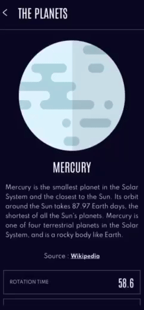
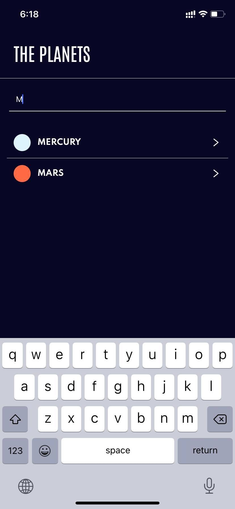
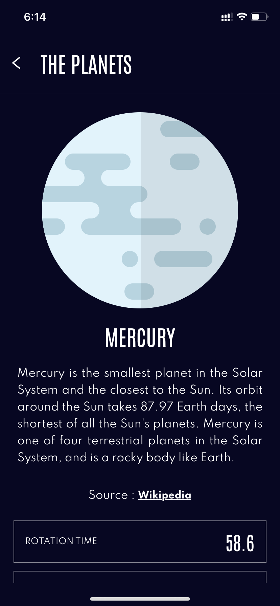
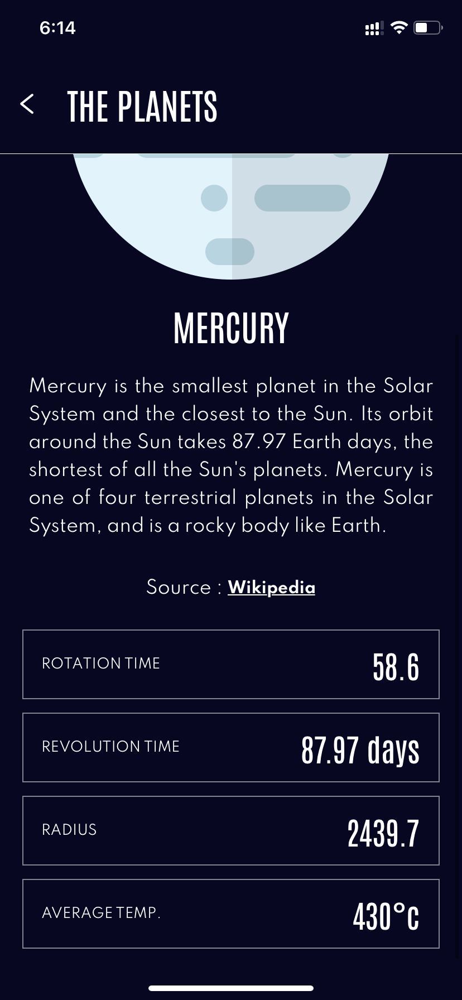

# Planets App In React native.

This is app is inspired from one of my instructor Saad bashar Bhai. He is a great instructor. I worked how he showed made my first App using "React-Native"

I wanted to create it in React Native. Finally did it.

# Screen Play :

# ScreenShot

#### Flutter App Screenshots

<table>
  <tr>
    <td>Home Screen</td>
     <td>Search Bar </td>
  </tr>
  <tr>
    <td></td>
     <td></td>
  </tr>
  <tr>
    <td>Details_Screen Top Side</td>
     <td>Details_Screen Bottom Side</td>
  </tr>
  <tr>
    <td></td>
    <td></td>  
  </tr>
 </table>
